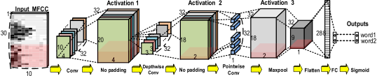
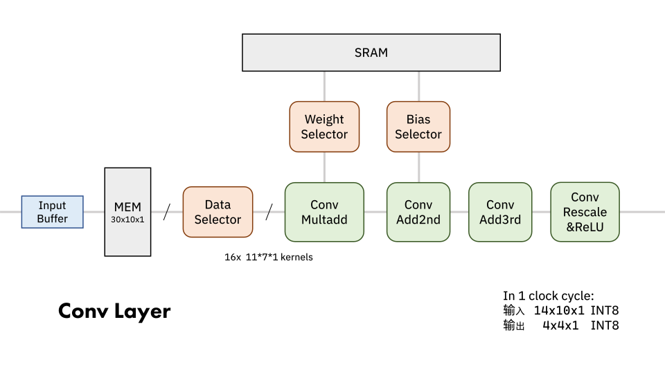

# MiniCNN

本项目基于 Verilog 实现了一个简单的 CNN，该卷积神经网络为一个简化的 MobileNet 结构，输入数据首先经过一个 11x7 的全卷积，然后依次进行由 3x3 的逐层卷积和 32 层的逐点卷积构成的深度可分离卷积，最后使用 2x2 的最大池化层进行特征整合，并将输出数据送入全连接层中进行数据压缩，经过 Sigmoid 激活函数输出最终分类结果。

<div align="center"></div>
<div align="center">Fig. 1: 网络结构示意图，修改自 [1]</div>

## Intro

整体的设计理念为构建一个全流水无停顿的计算架构，以达到较高的硬件利用率和数据吞吐量。

在待实现的网络结构中，全连接层的长度为 288。本设计的思路即为每周期计算得到这 288 个输出数据中的一个，在 288 个周期内完成所有一个完整输入特征图的处理。

对于全连接层中的一个数据，用类似感受野的方式找到其对应在各层的需要的输入数据，就构成了本设计的核心思路。需要注意的是，在逐层卷积和逐点卷积的连接处，需要额外的数据缓存，以保证数据在不同维度上的需求能得到满足。

<div align="center"></div>
<div align="center">Fig. 2: 设计架构示意图</div>

## Modules

### 1. Convolution Layer

第一层常规卷积的输入为单通道 30x10 的输入数据，输出为 32 通道 20x4 的特征图，卷积核大小为 11x7，步长为 1，无边缘填充，激活函数为 ReLU。

本设计采用每周期输入一层的 14x10 个数据、输出同一层中的 4x4 个数据，每周期切换卷积核的方式，按照数据流流动方向，分为数据选择模块、分三阶完成的乘累加模块、以及最后的激活及重量化模块。

在数据选择模块，需要选择数据、卷积核权重、偏置 3 种数据。考虑到输入数据的并行力度为 16，也就是同时计算一个输出层的 4x4 个点的数据，首先通过 `DataSelector` 模块对数据进行选择和分拣，将 14x10 的数据分成有重合部分的 16 组 11x7 的数据，整理并发送到相应的卷积计算单元。此后经过一个乘累加模块和两层累加模块完成卷积计算，最后进行激活和重量化。

<div align="center"></img></div>
<div align="center">Fig. 3: 卷积层计算流程</div>

### 2. Depthwise Convolution Layer

第二层逐层卷积的输入为 32 通道 20x4 的特征图，输出为 32 通道 18x2 的特征图，卷积核大小为 3x3，步长为 1，无边缘填充，激活函数为 ReLU。

在本设计中，逐层卷积每周期输入一层的 4x4 个数据，输出同一层中的 2x2 个数据。

逐层卷积的思路与全卷积层类似，虽然输入为 32 通道，但实际每周期只接收一个通道中 4x4 个数据，输出一个通道的 2x2 个数据，在 32 个周期输出 32 个通道的 2x2 个数据。在数据选择模块将其拆分为 4 组 3x3 的数据，分别送入相应的卷积计算单元。此后，经过一个乘累加模块和一个累加模块完成卷积计算，最后进行激活和重量化，再通过 `OutputControl` 模块将数据放入 Buffer 中正确的层位置。

<div align="center"></img></div>
<div align="center">Fig. 4: 逐层卷积层计算流程</div>

### 3. Pointwise Convolution Layer

第三层逐点卷积的输入为 32 通道 18x2 的特征图，输出为 32 通道 18x2 的特征图，卷积核大小为 32 层的 1x1 点卷积核，步长为 1，无边缘填充，激活函数为 ReLU。

在本设计中，逐点卷积每周期输入 Buffer 中的 32 层的 2x2 个数据，输出同一层中的 2x2 个数据，每周期切换卷积核计算。

在上一层中，32 个周期能输出 32 个通道的 2x2 个数据填满 Buffer，而逐点卷积共有 32 个不同的卷积核，使用这些数据也恰好需要 32 个周期的时间，因此添加逐层卷积和逐点卷积之间的 Buffer 后，数据填入和消耗的速度可以达到匹配，不需要进行流水线的停顿。

<div align="center"></img></div>
<div align="center">Fig. 5: 逐点卷积层计算流程</div>

### 4. PostProcess Layer

本设计将最大池化、全连接层和 Sigmoid 输出等操作整合为一个 PostProcess 层，输入为 32 通道 18x2 的特征图，在全连接层中使用两套不同的权重和偏置，输出为 2 个 FLOAT32 数据。

每个周期，后处理层接收上一层输出的 2x2 个数据，经过最大池化层后得到单个数据。在硬件层面，实际不需要展开操作，直接这个数据与权重相乘后添加到全连接层缓存的乘累加结果中，经过 288 个周期即可得到一张特征图的对应的 2 个全连接层 INT32 输出。INT32 输出经过重量化变为 INT8 数值，再通过 Sigmoid 激活函数输出最终分类结果。为避免复杂的浮点运算，本设计使用 SRAM 查找表来实现 Sigmoid 函数。

<div align="center"></img></div>
<div align="center">Fig. 6: 后处理层计算流程</div>

## Simulation

首先克隆本仓库

```shell
git clone https://github.com/Imiloin/MiniCNN.git
cd MiniCNN
```

在 `sim` 目录下，提供了可用于 ModelSim 的 `do` 脚本。在 `sim` 目录启动 ModelSim

```shell
cd sim
modelsim
```

此后在 ModelSim 的命令窗口中，运行编译脚本和仿真脚本

```modelsim
ModelSim> project close
ModelSim> do build.do
ModelSim> do sim.do
```

在 ModelSim 控制台中，可以看到 496 个测试输入的仿真结果。在 `sim/samples` 目录下包含了用于调整数据格式的 python 脚本。

<div align="center">Tab 1: 部分仿真结果与理论结果</div>
<div align="center"></img></div>

## A little more

本课程项目的体验十分糟糕，题目难度很不合理，提供的文档中许多细节都未表述清楚。做出来的这种 CNN 架构早已过时，实际价值约等于零。同时，这门课的教师也完全不上心，几乎提供不了指导。

基于上述原因，不对项目的具体细节作进一步介绍。

## References

\[1\] W. Shan *et al.*, "A 510-nW Wake-Up Keyword-Spotting Chip Using Serial-FFT-Based MFCC and Binarized Depthwise Separable CNN in 28-nm CMOS," in *IEEE Journal of Solid-State Circuits*, vol. 56, no. 1, pp. 151-164, Jan. 2021, doi: 10.1109/JSSC.2020.3029097.
